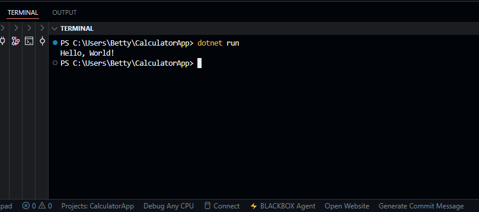
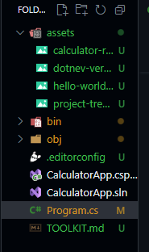
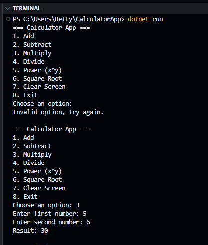

# Getting Started with C# (.NET) — A Beginner’s Toolkit: Console Calculator

**Author:** Betty Jelagat
**Project Window:** Sept 1–4
**Repo:** [CalculatorApp](https://github.com/bettyje/CalculatorApp)
**Run Target:** Windows 10+ (works on macOS/Linux with .NET too)

---

## 1) Title & Objective

**Title:** Prompt‑Powered Kickstart: Building a Beginner’s Toolkit for C# (.NET)
**Objective:** Learn C# from scratch by building a small but functional menu‑driven calculator that runs in the terminal. It supports addition, subtraction, multiplication, division, power (x^y), square root, clear screen, and exit.

**End goal proof:**

* Runs with a single command: `dotnet run`
* Shows a menu and performs calculations correctly
* Includes screenshots of setup and output

---

## 2) Quick Summary of the Technology

**What is C#?**
C# (pronounced “see‑sharp”) is a modern, object‑oriented programming language created by Microsoft. It’s used for web apps, desktop apps, games (Unity), mobile apps, and cloud services.

**Where is it used?**

* **Web:** ASP.NET Core
* **Desktop:** WinForms, WPF, MAUI
* **Games:** Unity (C# scripting)
* **Cloud:** Azure services and serverless functions

**Real‑world example:** Unity game projects are scripted in C#; many enterprise apps run on ASP.NET Core.

---

## 3) System Requirements

* **OS:** Windows 10 or later (tested), macOS or Linux also work
* **SDK:** .NET SDK 8 or 9 (tested with 9.0.301)
* **Editor:** Visual Studio Code
* **Tools:** Git (for version control), Command Prompt/PowerShell

**Verify versions:**

```bash
# .NET
dotnet --version   # expected: 8.x or 9.x (e.g., 9.0.301)

# Git
git --version      # expected: git version X.Y.Z
```


---

## 4) Installation & Setup (Windows)

1. **Install .NET SDK:** Download the latest SDK from the official .NET site and run the installer.
2. **Install VS Code:** Download and install Visual Studio Code.
3. **Open Terminal:** Press `Win + R`, type `cmd`, press Enter.
4. **Create project folder and scaffold app:**

   ```bash
   dotnet new console -o CalculatorApp
   cd CalculatorApp
   ```
5. **Open in VS Code (optional but recommended):**

   ```bash
   code .
   ```

   If `code` isn’t recognized, enable “Shell Command” from VS Code or open VS Code manually (File → Open Folder…).
6. **Run the template app:**

   ```bash
   dotnet run
   ```

   Expected output: `Hello, World!`



**Project Explorer:**



---

## 5) Minimal Working Example (Calculator)

**What it does:** Presents a menu in the terminal. You pick an option (Add/Subtract/Multiply/Divide/Power/Square Root/Clear/Exit), enter numbers, and it prints the result. It loops until you exit.

**File:** `Program.cs`

**How to run:**

```bash
dotnet run
```

**Code:**

```csharp
using System;

class Program
{
    static void Main(string[] args)
    {
        bool keepRunning = true; // keep the app on until user chooses Exit

        while (keepRunning)
        {
            Console.WriteLine("=== Calculator App ===");
            Console.WriteLine("1. Add");
            Console.WriteLine("2. Subtract");
            Console.WriteLine("3. Multiply");
            Console.WriteLine("4. Divide");
            Console.WriteLine("5. Power (x^y)");
            Console.WriteLine("6. Square Root");
            Console.WriteLine("7. Clear Screen");
            Console.WriteLine("8. Exit");
            Console.Write("Choose an option: ");

            string? choice = Console.ReadLine(); // read user option (can be null)

            switch (choice)
            {
                case "1":
                    PerformOperation("add");
                    break;
                case "2":
                    PerformOperation("subtract");
                    break;
                case "3":
                    PerformOperation("multiply");
                    break;
                case "4":
                    PerformOperation("divide");
                    break;
                case "5":
                    PerformOperation("power");
                    break;
                case "6":
                    PerformSquareRoot();
                    break;
                case "7":
                    Console.Clear(); // tidy the screen
                    break;
                case "8":
                    keepRunning = false; // exit the loop
                    break;
                default:
                    Console.WriteLine("Invalid option, try again.");
                    break;
            }

            Console.WriteLine(); // blank line for readability
        }
    }

    // Handles two-number operations
    static void PerformOperation(string operation)
    {
        Console.Write("Enter first number: ");
        double num1 = Convert.ToDouble(Console.ReadLine());

        Console.Write("Enter second number: ");
        double num2 = Convert.ToDouble(Console.ReadLine());

        double result = 0;

        switch (operation)
        {
            case "add":
                result = num1 + num2;
                break;
            case "subtract":
                result = num1 - num2;
                break;
            case "multiply":
                result = num1 * num2;
                break;
            case "divide":
                if (num2 == 0)
                {
                    Console.WriteLine("Error: Cannot divide by zero!");
                    return; // stop here and go back to menu
                }
                result = num1 / num2;
                break;
            case "power":
                result = Math.Pow(num1, num2); // x^y
                break;
        }

        Console.WriteLine($"Result: {result}");
    }

    // Handles one-number operation
    static void PerformSquareRoot()
    {
        Console.Write("Enter a number: ");
        double num = Convert.ToDouble(Console.ReadLine());

        if (num < 0)
        {
            Console.WriteLine("Error: Cannot calculate square root of a negative number!");
            return;
        }

        double result = Math.Sqrt(num);
        Console.WriteLine($"Result: {result}");
    }
}
```

**Expected interaction:**

```
=== Calculator App ===
1. Add
2. Subtract
3. Multiply
4. Divide
5. Power (x^y)
6. Square Root
7. Clear Screen
8. Exit
Choose an option: 1
Enter first number: 12
Enter second number: 8
Result: 20
```



---

## 6) AI Prompt Journal

**Prompt:** Explain C# to a total beginner. What is the smallest console app I can build in 30 minutes? Show steps and commands for Windows.
**Response Summary:** Introduced C# and .NET, showed `dotnet new console` and `dotnet run`, explained `Program.cs`.
**Outcome:** Scaffolded and ran Hello World successfully.
**Helpfulness:** 5
**Reflection:** Learned about `Main()` entry point and CLI workflow.

**Prompt:** Generate a menu-driven console calculator in C# with add, subtract, multiply, divide, power, and square root.
**Response Summary:** Provided structure with methods and switch-case.
**Outcome:** Worked after minor edits.
**Helpfulness:** 5
**Reflection:** Understood methods and switch-case.

**Prompt:** Fix CS8600 nullable warning.
**Response Summary:** Suggested `string?` and null checks.
**Outcome:** Warning gone.
**Helpfulness:** 4
**Reflection:** Learned about nullable reference types.

**Prompt:** Draft beginner-friendly README and TOOLKIT.
**Response Summary:** Produced structure and copy.
**Outcome:** Clearer docs.
**Helpfulness:** 5
**Reflection:** Documentation improved.

(Add more prompts as you go)

---

## 7) Common Issues & Fixes

* **CS8600 nullable warning:** Fix with `string?` and null checks.
* **dotnet not recognized:** Reboot or reinstall SDK.
* **code not recognized:** Enable VS Code shell command or open folder manually.
* **FormatException:** Entered text instead of numbers. Fix: Use numeric input only.
* **Antivirus issues:** Allow app if blocked (rare).

---

## 8) References

* [Microsoft Learn — .NET & C#](https://learn.microsoft.com/en-us/dotnet/csharp/)
* [C# Language Reference](https://learn.microsoft.com/en-us/dotnet/csharp/language-reference/)
* [CLI Commands](https://learn.microsoft.com/en-us/dotnet/core/tools/)
* [Math Class](https://learn.microsoft.com/en-us/dotnet/api/system.math)

---

## 9) How to Run (for peers)

```bash
# Clone
git clone https://github.com/bettyje/CalculatorApp.git
cd CalculatorApp

# Run
dotnet run
```

Expected output: Menu appears; selecting options performs calculations.

---

## 10) Testing & Iteration Log

**Peer Name & OS:** <fill in>
**Steps Taken:** clone → run → test add/divide
**Issues:** <none or noted>
**Fix Applied:** <documented>
**Outcome:** <successful run>

---

## 11) Screenshots

* 
* 
* 
* 

---

## 12) License

MIT (optional, allows reuse)
